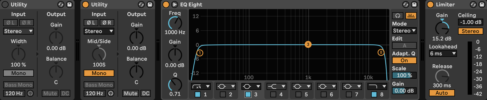

# Ableton Live Mastering 2

Mastering approach that uses a `EQ > Compress > Limit` chain.

## 3. Limit

1. Put a `Limiter` on the `Master` track, set `Lookahead: 6ms` and `Ceiling: -1db`
2. Turn up the gain on the `Limiter` until you hear audible distortion, than turn down the gain by `1db` less than that

## 1. EQ

Mid/Side Analysis & Adjustments

### Setup

The first `Utility` will be used to hear the mids, and the second sides.

1. Before the limiter, add a `Utility`, `Utility`, then `EQ Eight`
2. Set the both utilities to `Mono`.
3. Right-click the `Width` knob for the second `Utility` and set it to `Mid/Side`. Turn the `Mid/Side` dial all the way to the right (to `100S`).
3. For the `EQ Eight`:
    - Set `Mode: M/S`
    - Turn off all the stops except the farthest left and right. Set the leftmost `Filter Mode` to `48 dB` slope `low cut` (the `4x` option) and rightmost `Filter Mode` to `12 dB` slope cutoff.
    - Turn on the `3` stop and set the `Filter Mode` to `Bell` (we'll use this one to scan for frequencies)

### Analysis

#### Mids

1. Turn on only the first `Utility` to focus on mids
2. Listen to frequencies in the mids, use the `3` in the `EQ Eight` to scan for frequencies that sound resonant

#### Sides

1. Turn on only the second `Utility` to focus on sides
2. Listen to frequencies in the mids, use the `3` in the `EQ Eight` to scan for frequencies that sound resonant

### Adjustments

Do this for both mids and side, toggle between them by switching between `Edit: M` and `Edit: S` on the `EQ Eight`.

1. Drag the first stop from the farthest left until the track loses its warmth, or from the right to the left until the track gains its warmth. The first stop should use `low cut`, and either `48 dB` or `12 dB` depending on what sound better. (This can also alternatively be done by moving the leftmost stop all the way to the right, and then moving it left until the track *gains* its warmth.)
2. Look for sounds that are too loud and bring them down using `Bell` stops on the EQ Eight

## 2. Compress

### Kick Drum Sidechain EQ

1. Add a `Glue Compressor` between the `EQ Eight` and the `Limiter`
2. Toggle the disclosure arrow in the upper left of the `Glue Compressor` to show its full settings
3. Toggle on the `EQ` button (`Toggle Sidechain EQ`)
4. Find the fundamental frequency of the kick drum by using the a stop in the `EQ Eight`
5. Choose `Filter Type: Notch` (looks like a hill)
6. For the `Glue Compressor`, set the `Attack` a bit slow, around `8 ms`, and the `Release` faster, like `3 ms`
