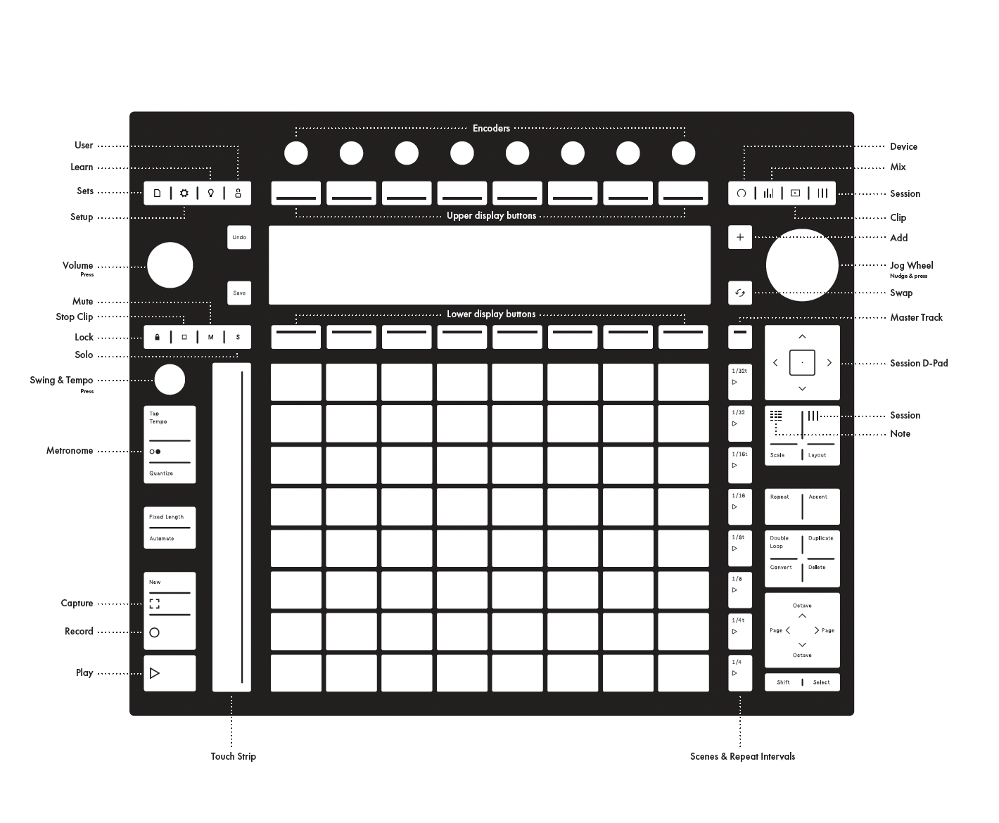

# Ableton Push Buttons

- **Top Right:** Device, Mixer, Clip, Session
- **Top Left, Below Knob:** Lock, Stop Clip, Mute, Solo
- **Below D-Pad:** Note, Session

## Delete

- Hold `Delete` and delete a track by pushing one of the bottom buttons, or a device by pushing one of the top buttons