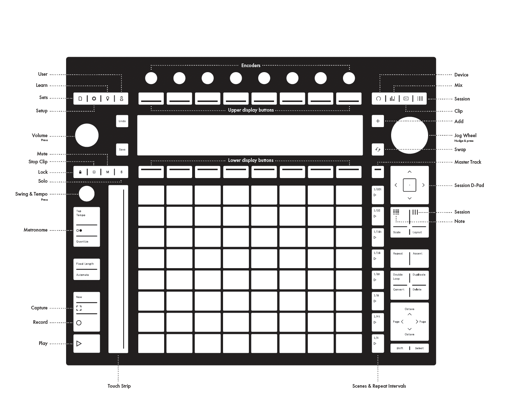

# Ableton Push UI

- **Top Right:** Device, Mixer, Clip, Session
- **Top Left, Below Knob:** Lock, Stop Clip, Mute, Solo
    - Hold the lock button and then one of the other buttons to lock it, so that just pressing another button triggers the action (e.g., if `Solo` is locked, then you can just push a button below a track to solo it)
    - There's no way to solo multiple tracks from push
- **Below D-Pad:** Note, Session

## Delete

- Hold `Delete` and delete a track by pushing one of the bottom buttons, or a device by pushing one of the top buttons
