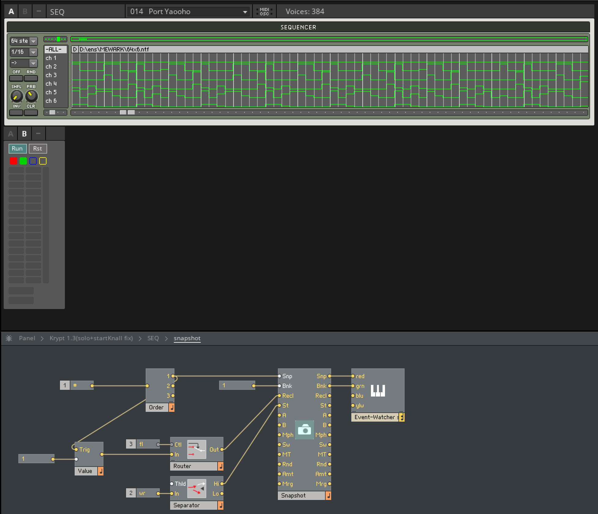

# Reaktor Debugging

- To toggle on debugging, click the bug icon to the left of the breadcrumbs
- Info Hints are shown when hovering if `View > Show Info Hints` is toggled on
- Use the `Event-Watcher small` module to inspect output

    

