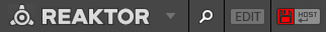
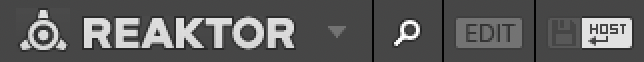
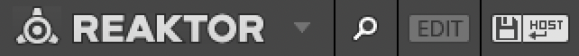

# Reaktor Host

## Basics

- Parameters changes are always saved with the host project.
- Some parts of the UI that seem like they should be parameters, are not, like some of the step sequencer interfaces.
- Other changes, like changes to the structure, or touching some parts of the user interface, will not be saved unless saving it turned on for the ensemble.
- The red disk icon always means that there are unsaved changes that will be lost if you quick the host application without saving.

## Saving

When running Reaktor within a host, the state of parameters is automatically saved with the host, but snapshots, properties, and changing the structure are not saved. To save these kinds of changes, you'll have to make a separate copy of your ensemble.

There are two methods of managing a separate copy:

1. Saving edited Ensembles manually
2. Saving edited Ensembles automatically

Factory Ensembles are write protected, so neither of these methods will ever overwrite a factory ensemble.

## States

Reaktor indicates the current state with these icons.

Host saving is off, and the Reaktor ensemble has changes, any changes will be lost if a saving method is not chosen.

Host saving is on, and the Reaktor ensemble has not been changed.

Host saving is on, and changes exist (these changes will be lost if the host is closed without saving)

## Commands

- The Reaktor menu is opened by clicking the triangle to the right of the Reaktor logo.
- To see the path to the current Ensemble, select "File > Show in Folder" from the Reaktor menu.

## Manual

To save an Ensemble manually, once a change has been made that requires saving, click the red "Save Ensemble" button in the upper left. If this is the first time you've clicked that button, you'll be prompted for a location to save the Ensemble. (If you click the button again later, it will overwrite the current save location.)

To access the save again to a new location, Reaktor menu and select "File > Save As…".

Note: It's unclear if a *User Library* ensemble is loaded, whether the first click to the "Save" icon will prompt for a save location or whether that's only for the Factory Library? As a convention, it's probably a good idea to always save to a new location the first time?

### Steps

Based on the above, this means the steps for saving a Ensemble manually are:

1. First setup your host project structure to have a place to save the ensemble (e.g., place your host project in a new folder).
2. Once a change has been made that requires saving, click the red save button and choose a location.
3. After making subsequent changes that require saving, click the red button again to save.

## Automatic

To automatically save an Ensemble when you save your host project, click the "Enable Automatic Saving with Host" button in the toolbar. You'll be prompted for a location to save. The "Enable Automatic Saving with Host" button should light up indicating that it's active. If you toggle automatic saving off and back on, you'll have to choose a new location again to save your project.

### Steps

1. First setup your host project structure to have a place to save the ensemble (e.g., place your host project in a new folder).
2. Click the "Enable Automatic Saving with Host" button in the toolbar
3. Continue working, saving your host project periodically.

## Notes

As a convention, always save the Ensemble in the same folder as the hosts project file. You'll usually want to make a container directory with both the hosts project file and the Ensemble inside, for example:

- `My Song`
    - `My Song.logicx`
    - `My Edited Ensemble.ens`