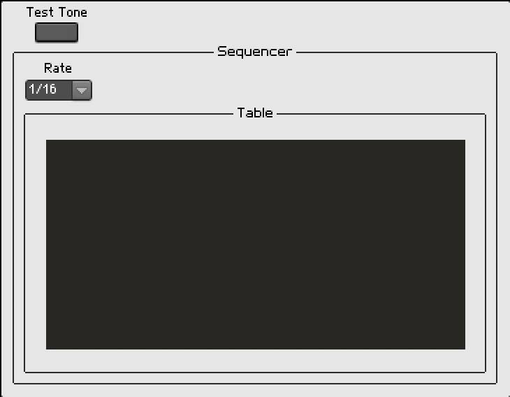
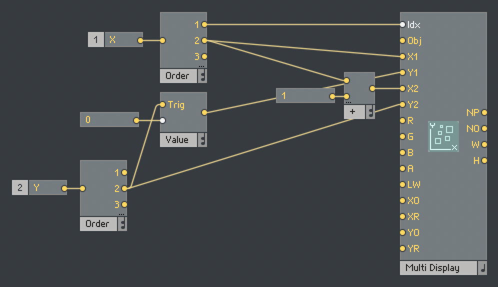
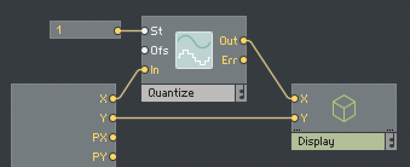
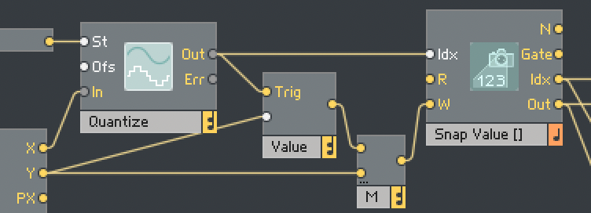

# Reaktor Advanced Step Sequencer

## Clean Up

1. Start with the finished Basic Step Sequencer
2. Delete the `Order` and `Event Table` modules
3. Add an empty `Macro` and rename it to `Table`
4. Double-click into the `Table` and add `In` and `Out` ports
5. Go back up a level and connect the `StpFlt > Out` to the `Table > In` and the `Table > Out` to the `Out`.

## Interface

1. Double-click into `Table`
2. Add a `Mouse Area`
3. Add a new `Macro` and name it `Display` (this macro is to make sure the display stays below the mouse area and doesn't block input)
4. Double-click into `Display` and add a `Multi Display` (since the `Multi Display` is in a macro one level lower, it will be under the `Mouse Area`)

## Clean Up

1. Unlock the panel
2. Toggle off `Multi Display > View > Show Label`
3. Set `Macro > View > Frame: None`
4. Move the panel elements so the `Table` and `Rate` are no longer overlapping
5. Set `Mouse Area > View > Width (Pixels): 300`
6. Set `Multi Display > View > Width (Pixels): 300`

    

## Wiring Together

### Display

1. Double-click into the `Display` macro, add two `In` ports and name them `X` and `Y`
2. Go back up a level to `Table` and connect the `Mouse Area` `X` & `Y` outputs to the `Display` `X` & `Y` inputs
3. Go back into the `Display` and wire up `X` and `Y` as follows:

    

    The second output of the `Order` module for the `Y` value is used to ensure it's processed after `Idx` is set.

4. Select the `Mouse Area` and under `Properties > Range Y`, set `Max: 12`, `Min: -12`, `Step Size: 1`
5. Select the `Mouse Area` and under `Properties > Range X`, set `Max: 16.4`, `Min: -0.6`, `Step Size: 0` *This is to compensate rounding up step sizes, e.g., a value of `1.5` will round up to `2`*

### Table

1. Go to `Sequencer > Table` in the structure and add a `Quantize` module and connect it like so

    

### Display

1. Go to `Sequencer > Table > Display` and select the `Multi Display`, under `Properties > Function`:
    1. Set `Object > Number: 16`
    2. Set `Range > X Origin: 1`
    3. Set `Range > X Range: 16`
    4. Set `Range > Y Origin: -12`
    5. Set `Range > Y Range: 24` (To work with the `Y Origin` to make the values `-12--12`)
    6. Toggle on `Status > Always Active`
2. Create two `1` constants and connect them to the `Multi Display > G` and `Multi Display > B` inputs. *This makes the color in the Multi-Display cyan*
3. Create a `-1` constant and connect it to the `Multi Display > Obj` input *This makes the display use solid bars, rather than lines*
4. Go back to `Sequencer > Table` and add `Value` and `Merge` objects and connect them like so. *This makes it so moving the mouse in horizontally updates the `Multi Display` even if the `Y` value isn't changing*

    

### Snapshots

1. Go to `Sequencer > Table`, and add a `Snap Value Array` module. Connect the `M` output to its `W` input, and the `Quantize > Out` output to its `Idx` input. Connect its `Idx` output to the `Display > X` input and its `Out` output to the `Display > Y` input.
