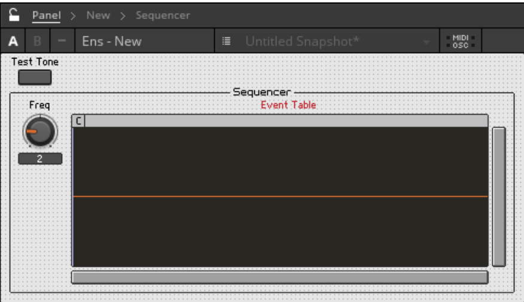
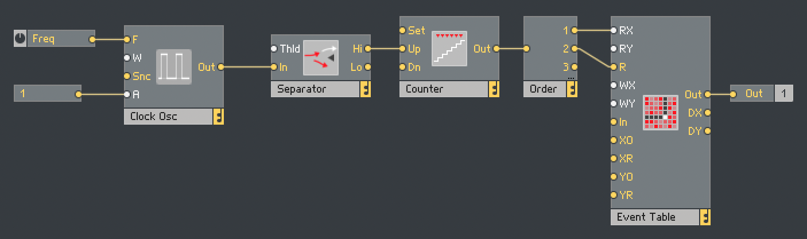
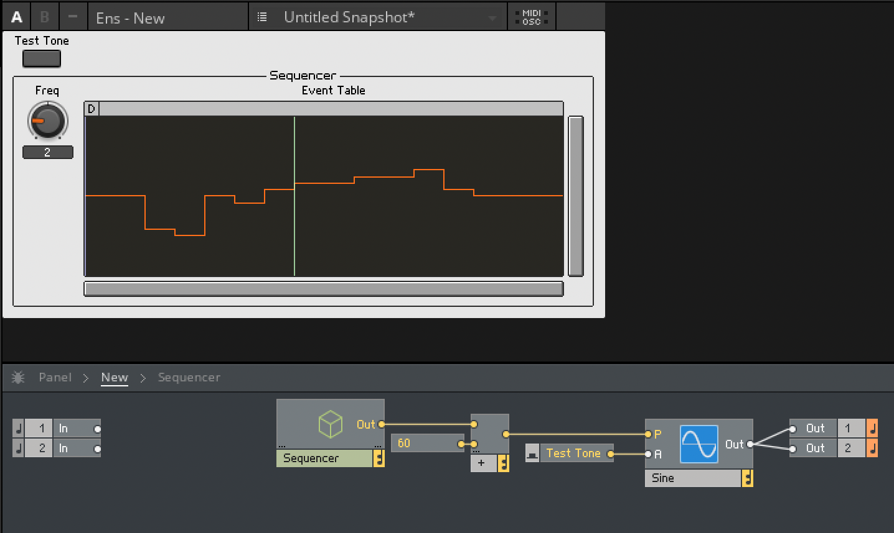

# Reaktor Basic Step Sequencer

## Test Tone

1. Create a new Ensemble
2. Add a `Sine Oscillator`
3. Add a `Button` and rename it to `Test Tone`
4. Connect the `Test Tone` output to the `Sine > A` input
5. Set `Test Tone > Properties > Range > On Value: 0.75` (this is to avoid an amplitude of `1` which can overload Reaktor)
6. Add a `Constant` and set its value to `60`, connect its output to the `P` input of `Sine`
7. Connect the `Sine > Out` output to the two `Out`
8. Now pressing the `Test Tone` button should toggle the tone

## Sequencer

1. Add a `Macro` and rename it to `Sequencer`

### Clock

1. Add a `Clock Oscillator` module to use as a clock source
2. Right-click the `Clock Osc > F` input and choose `Create Control`
3. Right-click the `Clock Osc > A` input and choose `Create Constant`
4. Add a `Separator` module, this will be used to filter out `0` events, so we can just use the output of `1` as our frequency
5. Connect the `Clock Osc > Out` output to the `Separator > In` input (and leave `Thld` disconnected because it defaults to `0`)
6. Add a `Counter`, connect the `Separator > Hi` output to the `Counter > Up` input

### Event Table

1. Add an `Event Table`
2. Set `Event Table > Function > Size > X: 16` (for a `16` step sequencer)
3. Under `Event Table > Function > Value Range`, set `Max: 12`, `Min: -12`, and `Stepsize: 1`
4. Unlock the panel and re-arrange the elements so they aren't overlapping, then lock it again

    

5. Right-click the `Event Table` in the panel and choose `Table Draw Mode`

### Connect Event Table & Counter

1. Add an `Order` module
2. Connect the `Order > 1` output to the `Event Table > RX` input, and the `Order > 2` output to the `Event Table > R` input. (`RX` sets the `X` value, and `R` outputs the current value. `Order` controls the order.)
3. Add an `Out` port and connect the `Event Table > Out` to its input

    

## Wiring Together

1. Go to the top level of the Ensemble
2. Add an `Add` module and connect the `Sequencer > Out` to its top input, and the `60` to its bottom input, connect it's output to the `Sine > P ` input

    

3. Playback can now be tested, when `Test Tone` is enabled, editing the Event Table changes the pitch.

## Adding Temp Sync

Replacing the `Clock Osc` with a sync to the host.

1. Delete everything related to the `Clock Osc` (from the `Counter` to the left)
2. Add a `Song Position (MIDI In)` module, connect the `Song Position > 96` output to the `Order` input
3. Hitting the Play button in the toolbar (`␣`) will now cause the transport to play
