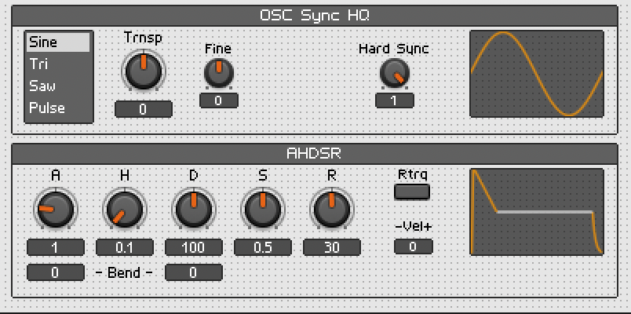

# Reaktor Subtractive Synthesizer

## Setup

1. Choose `File > New Ensemble`
2. Choose `Library > 02 - Oscillator > OSC Sync`
3. Choose `Library > 04 - LFO, Envelope > AHDSR`
4. Connect `OSC Sync HQ > Out` to `AHDSR > In`
5. Connect `AHDSR > Out` to `Out 1` and `Out 2`

## Cleanup Panel

1. Unlock the `Panel` by clicking the padlock icon
2. Drag the `AHDSR` below the `OSC Sync HQ`

    

3. Lock the `Panel` again by clicking the padlock icon
4. Open the search box (`↩`) and add a `Pitch and Gate (09 - Utility, Display)`
